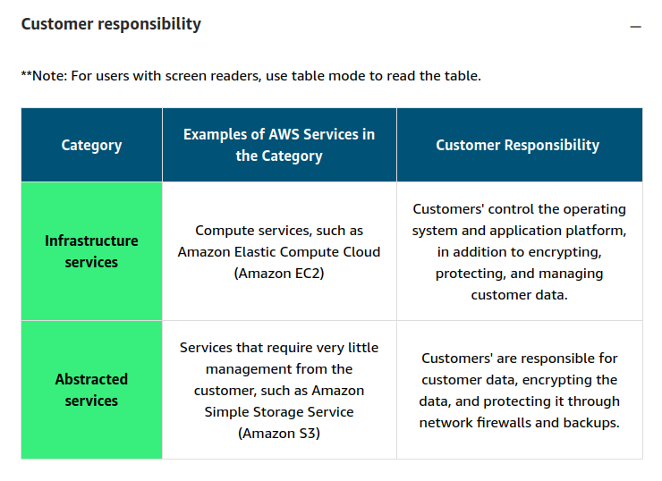

# Security and the AWS Shared Responsibility Model

## AWS Responsibility
* Responsible for security *of* the cloud
* AWS secures the physical infrastructure of the cloud, i.e., buildings, data centers, physical servers, connections between locations
  * Usual physical security controls, e.g., security guards, biometric access, disaster recovery, etc.
* It also manages
  * Additional hardware (e.g., routers, switches, etc)
  * Host Operating Systems
  * Virtualization layers

> The level of responsibility that AWS has depends on the service. AWS classifies services into two categories. The following table provides information about each, including the AWS responsibility.

In other words, AWS is responsible for everything *up to the virtualization layer*. Then security becomes the customer's responsibility.

## Customer Responsibility
* Responsible for security *in* the cloud
* Responsible for keeping data secure
  * Encryption
  * Data in transit / at rest
  * Scheduled backups
* Depends on the AWS service being used
  * More abstracted services (e.g., S3) require only protection of data and access control
  * Some services require maintenance of all security configuration and management

* When considering the Shared Responsibility Model, customers must evaluate
  * The AWS service in use and the division of labor particular to that service
  * Internal security policies unique to the customer
  * External laws, compliances, and regulations

> A key concept is that customers maintain complete control of their data and are responsible for managing the security related to their content.

## Resources
[AWS Shared Responsibility Model](https://aws.amazon.com/compliance/shared-responsibility-model/)
