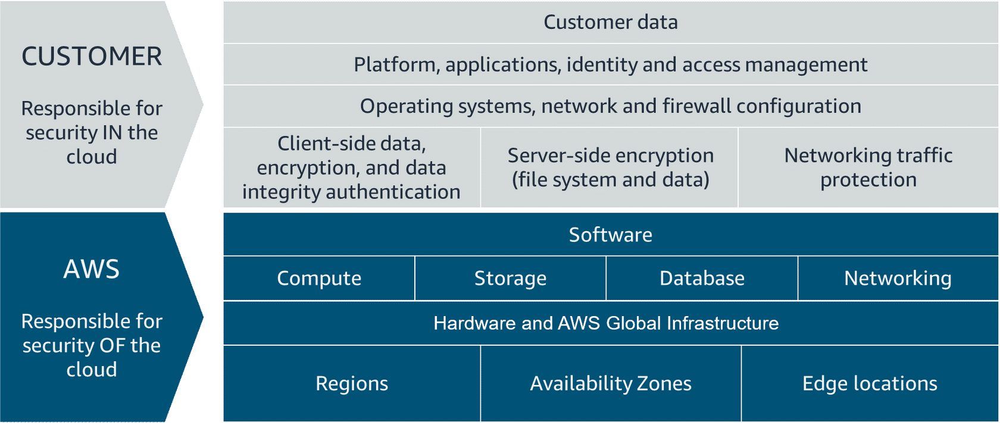
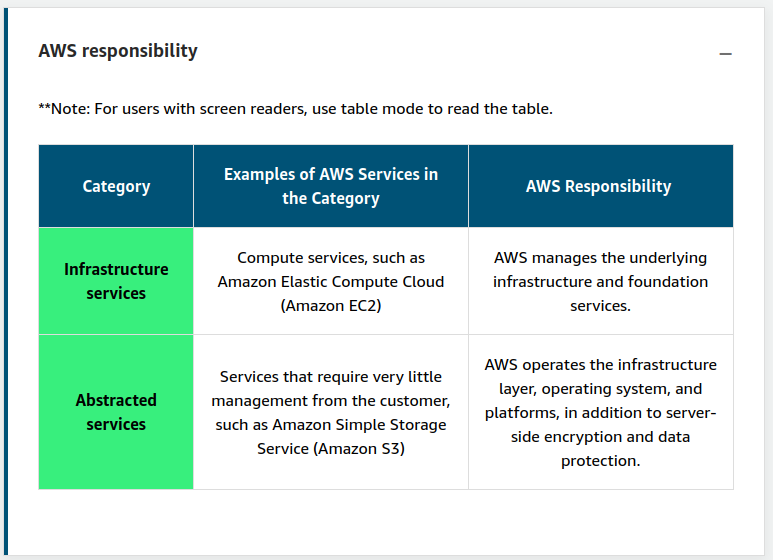

# Security and the AWS Shared Responsibility Model

## AWS Responsibility
* AWS secures the physical infrastructure of the cloud, i.e., buildings, data centers, physical servers, connections between locations
  * Usual physical security controls, e.g., security guards, biometric access, disaster recovery, etc.
* It also manages
  * Additional hardware (e.g., routers, switches, etc)
  * Host Operating Systems
  * Virtualization layers

> The level of responsibility that AWS has depends on the service. AWS classifies services into two categories. The following table provides information about each, including the AWS responsibility.

In other words, AWS is responsible for everything *up to the virtualization layer*. Then security becomes the customer's responsibility.

