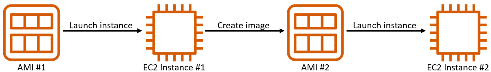

# Getting Started with Amazon EC2

- EC2 Instance Type
  - t3, a1, m5, etc
- EC2 Instance Size
  - medim, large, etc
- Resizable
- Reusable (via AMIs)
  
- Min payment is 60 seconds; Pay by second or hour
