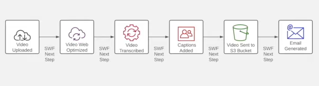

# Concepts
+ Service Control Policy (SCP) ->
+ Cross-account Role ->
  + External ID ->
+ Fargate
  + as it relates to containerization
+ Read replicas v. Elasticache for sub-mililsecond responses
+ Kineses Data Analytics
+ Difference between
  + NAT Instance
  + NAT Gateway
  + Internet Gateway
  + Virtual Private Gateway
+ Immutable Infrastructure
+ AWS X-Ray
+ Best practices for Disaster Recovery
+ AWS Direct Connect
+ AWS Batch
+ AWS Private Link
+ AWS Lake Formation
+ AWS Athena
+ AWS Quick Site
+ AWS Glue
+ AWS Data Sync
+ AWS Storage Gateway
+ How do de-couple workloads so they scale properly?
+ What kicks off scaling
+ Data Ingestion (Lake)
  - Transformation
  - Streaming Data
  - etc.
+ Right Sizing
  - Correct Storage Size
  - S3 Life Cycles
  - Load Balancing and Connectivity Cost Savings
  - AWS Transit Gateway
  - VPC Peering
  - DNS
  - Route 53
  - Elastic Load Bouncers
+ **AWS Well Architected Framework, the Sustainability Pillar**
DNS
---
### A Record
- The Most Fundamental Record
- Maps "A" Names to IP Addresses
- IPv6 uses "AAAA" names
### CNAME Record
- Record that maps a domain name to another domain name
- Can map to another CNAME record or an A record
- Effectively redirects a request from one domain to another
### NS Records
- Identifies the DNS Servers that are repsonsible for your DNS Zone
- Authoritative NS > Propagate an Organizations DNS information to DNS Servers across the Internet
### MX Record
- Specifies whtich Mail Servers can accept mail from your domain
- Necesary to be able to receive email

Routing Policies
----------------
### Simple Routing
- Default
- Maps a domain name to a single location
### Failover Routing
- Route traffic to Main Server
- On Failure, send to a Backup Server
### Geoloaction Routing
- Routes to the nearest Geographic Location based on requester's source IP address
- Region Based
### Geoproximity Routing
- Used when DNS servers are setup in multiple AZs
- Routes to the nearest AZ
- AZ Based
### Latency Based Routing
- "True" best latency
- Route53 determines lowest latency DNS server
### Multivalue Answer
- Route to anywhere
- Not very specific but does allow for load sharing
### Weighted Routing
- E.g.: 75% traffic to Server A
        25% traffic to Server B
- Good for application testing

Load Balancers
--------------
- Could have several compute instances (machines), but if they're not load balanced, essentially one machine is computing and the others are backups
- Load balancing allowns multiple compute instances to compute at the same time
- Increase performance by Scaling Out instead of just Scaling Up
- Increase Availability by removing Single Points of Failure
- Use Health Checks to increase Availability
### Network Load Balancers
- Operate at L4 (Transmit Layer) of the OSI Model (TCP/UDP)
### Application Load Balancers
- Operate at L7 (Application Layer) of the OSI Model (HTTP/HTTPS)
- Have a lot more intelligenc in them
### (3) Types available
- Elastic LB: **Application**
- Elastic LB: **Network**
- Classic LB: Legacy -> either Network or Application
### AWS LB Implementation - Elastic Load Balancer
- Distributes to multiple targets, e.g., EC2, Web Servers, etc.
- Auto-scaling
- Use an IP Address
  - When auto-scaling occurs, multiple IP addresses will be used
  - Plan the subnets accordingly or the system will can run out of address space
- Can balance across AZs
- Support Health Checks
  - Removes unhealthy servers out of rotations
- Can terminate SSL Connections
  - Also reduces load (e.g., abandoned sessions)
### Network Load Balancer
- Fastest (can handle millions of request per second)
- Sit at the perimiter of the VPC
- Route traffic based on Destination Port (E.g, Port 80)
- Excelent w/ rapidly changing traffic patterns
- Stateful Connections (keeps track of what's going out, then back in and vice/versa, I suppose)
- Connection (Host <=> Server) is maintained until the Session has ended
- *Sticky Sessions* -> "Remembers" the user source and destination IPs
  - Aids in good performance
  - AuthN & AuthZ good for the Session
### Application Load Balancer
- Route based on several variables
  - URL Path
  - Headers
  - HTTP Method (GET, PUSH, etc)
  - Can route based on source address
- PEQ: Ideal for balancing requests to Microservices and Container-Based applications
- Can Load Balance between AWS VPC and On-Premise Data Center
- Stateful Connections
### Legacy (Classic) Load Balancer
- Still available, but not recommended - Elastic should be used
- Available in both Network and Application forms
- Legacy: Can work with both EC2-Classic and VPCs
- Auto-scaling Capabilities
- Can support Single or Multiple AZs, just like Modern ALB/ELB
- Can also terminate SSL Connections
- Provides Logs to analyze traffic flows
- Can be used w/ CloudTrail for Auditing
### Securing the AWS VPC
...

### AWS Applictions and Services
- SQS
- SNS
- SWF
- Elastic Map Reduce
- Kineses
- ECS
- EKS
- ElasticBeanstalk
- CloudWatch
- CloudTrail
- AWS Config
- CloudFront
- Lambda
- AWS Step Functions
- Rekognition
- Cloud Formation
- Certificate Manager

### AWS SQS
- Provides modularity to increase Availabiity and Scalability
- Segmenation and Decoupling Application Architectres can dramatically inprove Scalability by removing System Bottlenecks
- AWS Amazon Simple Queueing Service helps Decoupling Architectures
- Message Queuing Service that provides Temp Storage
- Enhances Availability by providing a means to keep Messages from being lost
- Transient Storage
  - Default Queue Retention is 4 days
  - Configurable to up to 14 days
- Enables Right (Proper) Sizing of Applications
- Facilitates Auto-Scaling
- Mitigates the need for Messaging Middleware in Multi-Tiered Applications
- Types of queues
  - Standard Queues -> messages come in, then go out
      - Very fast throughput
      - At Once Delivery
      - No guarantee of the order -> Best Effort Delivery
  - FIFO Query
      - Still High Throughput, but much slower than Standard Queues
      - Guarantees Message processing in the order received
      - Possible increase in latency, since slower processing messages may slow the queue
   - Dead Letter Queues (DLQ)
      - Feature to Retain Messages if a Delivery Error Occurs
- How SQS Works
  1. Messages are sent from the computing platform to the queue
  2. Once inside the queue, the message can be scheduled for delivery
  3. Message stays in Queue if the Destination is busy, either until
    - Processes
    - Timed Out
  4. Messages can stay in Queue for up to 14 days, if so configured
  5. Message is pulled from Queue to be Processed
  6. After Processessing, the Message is Deleted from the Queue

### AWS SNS (Simple Notification Service)
- Managed Messaging Service to deliver messages between system, and/or people
- Decouples messages between Microservice Applications
- Used to send SMS, Email and Push Messages to Mobile Devices
- Facilitates Communication between Senders and Recipients via a Publish/Subscribe Model
- The (Pub-Sub) Messaging Model Enables Notiification delivery to Clients via a Push Mechanism which alerts Clients to Updates
- How SNS works
  - Consists of Two Components
    - Publishers
    - Subscribers
  - Publishers Communicate by sending Messages to a Topic
  - Subcribers subscribe to the Topic and Receives Messages
  - Think of a Mailing List
- High Availability platform that runs across Multiple AZs by default
- Can be used to fanout messages to a large number of Subscriber Systems or Computing Endpoints
  - E.g., SQS queues, Lambda functions, etc.
- Allows for the creation of **Filter Policies** so that you only receive Nofifications for what You're interested in
- Encrypts Messages immediately to protect form Unauthorized access
- Where is SNS Used?
  - Application and System Alerts
    - E.g., CPU Utilization is over 80%, Notify System Administrators
  - Email and Text Messages
    - Can send Push Notifications to People via Email / Text
    - E.g., a Company's CEO event is to occur and a Message is Sent to all Employees
  - Mobile Notifications
    - Can sned Push Notifications Directoy to Mobile Applications
    - E.g., Notify Users of a Flash Sale on your Application

### AWS SWF (Simple Workflow System)
- SWF is a Workflow Management Solution
- Enables the Coordination of different Tasks across Distributed Applications
- Enables the creation of a Workflow of Tasks that take multiple steps to complete
- Coordinates the execution of Tasks in Distributed Applications
- Mitigates the need to Develop Code to Coordinate Tasks in Multiple Systems.
  - Saves Development Time
- A Pre-Built Worflow Management Solution.
  - Just tell SWF the Necessary Workflow Steps
  - SWF Handles all of the Coordination
- For Example:
  1. Video is Uploaded
  2. Video is Processed and Converted to an Optimized Format
  3. After Formatting the Video is Transcribed
  4. After Transcription, Subtitles are added
  5. After Final Processing, the Video is Stored
  6. After the Video is Ready, the User gets a Notification to download their video
    

### AWS Elastic Beanstalk
- A Service for Provisioning, Deploying, and Scaling Web Applications and Services
- Code is Uploaded to Beanstalk, then automatically deployed to necessary Infrastructure
  - EC2, Containers (ECS/EKS), Load Balancers, etc.
- Deployed Architecture is Auto-Scaling
- Autoscaled infrastructure is automatically load balanced
- Works w/ Go, Java, .NET, Node.js, PHP, Python, Ruby
- Provisions and Manages the Environment, but All
